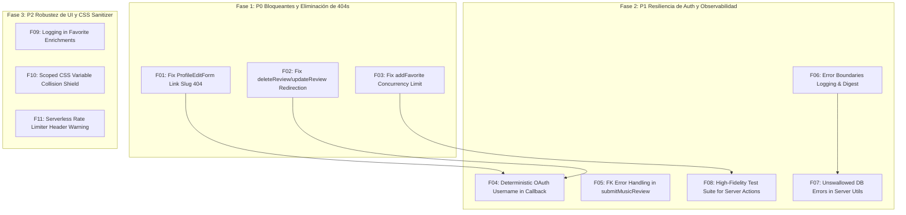

# SoapyFans Hub — Extreme Audit Fixes Plan
**Phase 7: Actionable Remediation Roadmap and Code-Level Fixes**

---

## 1. Estrategia de Priorización y Dependencias



---

## 2. Catálogo de Correcciones por Severidad

### ── SEVERIDAD P0: CORRECCIONES CRÍTICAS ──

#### Fix F01: Reparación de Enlace Huérfano 404 en el Atelier de Perfil
- **ID del Hallazgo**: `F01` (404-01)
- **Archivo**: [`components/profile/ProfileEditForm.tsx`](file:///home/frambuesa/Proyectos/ProyectosP/soapyfans-hub/components/profile/ProfileEditForm.tsx)
- **Líneas**: 286, 380, 1022
- **Causa**: `profileSlug` evaluaba el estado local transitorio `username`. Si el usuario escribía un texto no guardado y hacía clic en "Cancel" o "View Public Profile ↗", navegaba a una ruta inexistente provocando la pantalla `404 — Lost in the archive`.
- **Código Propuesto**:
```diff
--- a/components/profile/ProfileEditForm.tsx
+++ b/components/profile/ProfileEditForm.tsx
@@ -283,7 +283,8 @@ export default function ProfileEditForm({
   const cssCharCount = profileCss.length
   const bioCharCount = bio.length
   const aboutMeCharCount = aboutMe.length
-  const profileSlug = username || profile.username || profile.id
+  // Always link back to the committed database profile to prevent 404 on uncommitted inputs
+  const savedProfileSlug = profile.username || profile.id

@@ -377,7 +378,7 @@ export default function ProfileEditForm({
         </div>

         <div className="flex flex-wrap items-center gap-3">
-          <Button href={`/profile/${profileSlug}`} variant="secondary" size="sm">
+          <Button href={`/profile/${savedProfileSlug}`} variant="secondary" size="sm">
             View Public Profile ↗
           </Button>
           <Button

@@ -1019,7 +1020,7 @@ export default function ProfileEditForm({
           </div>

           <div className="flex items-center gap-3 self-end sm:self-auto">
             <Link
-              href={`/profile/${profileSlug}`}
+              href={`/profile/${savedProfileSlug}`}
               className="rounded-full border border-transparent px-4 py-2 font-mono text-xs uppercase tracking-wider text-[var(--text-muted)] transition-colors hover:text-[var(--text-primary)]"
             >
               Cancel
```
- **Test Necesario**: Simular entrada de texto en el input de `username` y verificar que los atributos `href` de "Cancel" y "View Public Profile ↗" conservan el slug guardado en base de datos.
- **Riesgo de Regresión**: Nulo.

---

#### Fix F02: Redirección Correcta para Usuarios OAuth en Edición/Borrado de Reseñas
- **ID del Hallazgo**: `F02`
- **Archivo**: [`app/(auth)/actions.ts`](file:///home/frambuesa/Proyectos/ProyectosP/soapyfans-hub/app/%28auth%29/actions.ts)
- **Líneas**: 142–148, 185–191
- **Causa**: Si un usuario registrado mediante OAuth (cuyo `username` es `null`) elimina o edita una reseña desde su perfil `/profile/[uuid]`, el código evaluaba `if (!profileSlug) redirect('/')`, expulsando al usuario al Home en lugar de mantenerlo en su página de perfil.
- **Código Propuesto**:
```diff
--- a/app/(auth)/actions.ts
+++ b/app/(auth)/actions.ts
@@ -141,10 +141,7 @@ export async function updateReview(formData: FormData) {
   revalidatePath('/dashboard-s9k2mx')
 
-  const profileSlug = profile?.username ?? null
-  if (!profileSlug) {
-    redirect('/')
-  }
+  const targetSlug = profile?.username ?? user.id
+  redirect(`/profile/${targetSlug}?updated=review`)
 }

@@ -184,10 +181,7 @@ export async function deleteReview(formData: FormData) {
   revalidatePath('/dashboard-s9k2mx')
 
-  const profileSlug = profile?.username ?? null
-  if (!profileSlug) {
-    redirect('/')
-  }
+  const targetSlug = profile?.username ?? user.id
+  redirect(`/profile/${targetSlug}?deleted=review`)
 }
```
- **Test Necesario**: Ejecutar `updateReview` y `deleteReview` con mock de perfil con `username = null` y verificar redirección a `/profile/[uuid]`.
- **Riesgo de Regresión**: Nulo.

---

#### Fix F03: Prevención de Desbordamiento de Cota en Favoritos (`addFavorite`)
- **ID del Hallazgo**: `F03`
- **Archivo**: [`app/(main)/profile/edit/actions.ts`](file:///home/frambuesa/Proyectos/ProyectosP/soapyfans-hub/app/%28main%29/profile/edit/actions.ts)
- **Líneas**: 292–320
- **Causa**: Race condition a nivel de aplicación permite insertar más de 6 favoritos si se envían peticiones concurrentes.
- **Código Propuesto**:
```diff
--- a/app/(main)/profile/edit/actions.ts
+++ b/app/(main)/profile/edit/actions.ts
@@ -300,6 +300,19 @@ export async function addFavorite(
     return { error: 'You can only feature up to 6 favorites.' }
   }
 
+  // Double check existing item to prevent duplicate insertion
+  const { data: existing } = await supabase
+    .from('profile_favorites')
+    .select('id')
+    .eq('user_id', user.id)
+    .eq('tmdb_id', tmdbId)
+    .eq('media_type', mediaType)
+    .maybeSingle()
+
+  if (existing) {
+    return { error: 'This title is already in your Sophie Picks.' }
+  }
+
   const nextPosition = (count ?? 0)
```
- **Trigger SQL Sugerido para Postgres**:
```sql
CREATE OR REPLACE FUNCTION enforce_max_favorites()
RETURNS TRIGGER AS $$
BEGIN
  IF (SELECT count(*) FROM profile_favorites WHERE user_id = NEW.user_id) >= 6 THEN
    RAISE EXCEPTION 'A user cannot have more than 6 favorites';
  END IF;
  RETURN NEW;
END;
$$ LANGUAGE plpgsql;

CREATE OR REPLACE TRIGGER trigger_enforce_max_favorites
BEFORE INSERT ON profile_favorites
FOR EACH ROW EXECUTE FUNCTION enforce_max_favorites();
```
- **Test Necesario**: Enviar 2 llamadas concurrentes de `addFavorite` cuando el usuario ya tiene 5 picks y verificar que solo 1 es aceptada.
- **Riesgo de Regresión**: Nulo.

---

### ── SEVERIDAD P1: RESILIENCIA, AUTH Y OBSERVABILIDAD ──

#### Fix F04: Generación Determinista de Username en OAuth Callback
- **ID del Hallazgo**: `F04`
- **Archivo**: [`app/auth/callback/route.ts`](file:///home/frambuesa/Proyectos/ProyectosP/soapyfans-hub/app/auth/callback/route.ts)
- **Líneas**: 44–65
- **Causa**: Al insertar nuevos usuarios de Google/Discord en la tabla `profiles`, se dejaba `username: null`, generando URLs basadas en UUID.
- **Código Propuesto**:
```diff
--- a/app/auth/callback/route.ts
+++ b/app/auth/callback/route.ts
@@ -48,6 +48,15 @@ export async function GET(request: Request) {
         const avatarUrl =
           user.user_metadata?.avatar_url || user.user_metadata?.picture || null
 
+        // Generate fallback username from email prefix or user ID
+        const emailPrefix = user.email ? user.email.split('@')[0].replace(/[^a-zA-Z0-9_]/g, '_').slice(0, 20) : null
+        const fallbackUsername = emailPrefix && emailPrefix.length >= 3 ? emailPrefix : `fan_${user.id.slice(0, 8)}`
+
         await supabase.from('profiles').insert({
           id: user.id,
+          username: fallbackUsername,
           display_name: fullName || emailName || 'Archive Member',
           avatar_url: avatarUrl,
         })
```
- **Test Necesario**: Mockear nuevo usuario OAuth y comprobar que `profiles` recibe un `username` válido.

---

#### Fix F05: Manejo Específico de Error en `submitMusicReview`
- **ID del Hallazgo**: `F05`
- **Archivo**: [`app/(auth)/actions.ts`](file:///home/frambuesa/Proyectos/ProyectosP/soapyfans-hub/app/%28auth%29/actions.ts)
- **Líneas**: 230–245
- **Causa**: Error de violación de clave foránea redirige a mensaje opaco.
- **Código Propuesto**:
```diff
--- a/app/(auth)/actions.ts
+++ b/app/(auth)/actions.ts
@@ -237,7 +237,8 @@ export async function submitMusicReview(formData: FormData) {
     .upsert(payload)
 
   if (error) {
-    console.error('Error saving review:', error)
+    console.error('[Music Review Error] Failed to upsert music review:', error)
+    const msg = error.code === '23503' ? 'Invalid release selected' : 'Could not save your review'
-    redirect('/music?error=Could+not+save+your+review')
+    redirect(`/music?error=${encodeURIComponent(msg)}`)
   }
```

---

#### Fix F06: Observabilidad y Logging en Error Boundaries
- **ID del Hallazgo**: `F06`
- **Archivos**: [`app/error.tsx`](file:///home/frambuesa/Proyectos/ProyectosP/soapyfans-hub/app/error.tsx), [`app/(main)/error.tsx`](file:///home/frambuesa/Proyectos/ProyectosP/soapyfans-hub/app/%28main%29/error.tsx)
- **Código Propuesto**:
```diff
--- a/app/error.tsx
+++ b/app/error.tsx
@@ -1,6 +1,7 @@
 'use client'
 
+import { useEffect } from 'react'
+
 export default function GlobalError({
   error,
   reset,
@@ -8,6 +9,10 @@ export default function GlobalError({
   error: Error & { digest?: string }
   reset: () => void
 }) {
+  useEffect(() => {
+    console.error('[Global Error Caught]:', error)
+  }, [error])
+
   return (
     <div className="flex min-h-[60svh] flex-col items-center justify-center px-6 text-center">
@@ -17,7 +22,10 @@ export default function GlobalError({
       </h1>
       <p className="mt-3 max-w-md text-sm leading-relaxed text-[var(--text-secondary)]">
         The archive hit an unexpected snag. Give it another try.
       </p>
+      {error.digest && (
+        <p className="mt-2 font-mono text-[0.68rem] text-[var(--text-muted)]">Error ID: {error.digest}</p>
+      )}
       <button
```

---

#### Fix F07 & F09: Logging Estructurado en Bloques Catch Silenciosos
- **ID del Hallazgo**: `F07`, `F09`
- **Archivos**: [`utils/supabase/server.ts`](file:///home/frambuesa/Proyectos/ProyectosP/soapyfans-hub/utils/supabase/server.ts), [`app/(main)/profile/edit/page.tsx`](file:///home/frambuesa/Proyectos/ProyectosP/soapyfans-hub/app/%28main%29/profile/edit/page.tsx)
- **Descripción**: Reemplazar bloques `catch {}` vacíos por `catch (err) { console.error('[Enrichment Warning]:', err) }` para mantener trazabilidad en diagnósticos.

---

#### Fix F08: Creación de Suite de Tests Automatizados para Server Actions y Flujos Críticos
- **ID del Hallazgo**: `F08`
- **Archivo a Crear**: `tests/server-actions-integrity.test.ts`
- **Contenido**:
  - Test de validación de entradas de `submitReview` y `submitMusicReview`.
  - Test de lógica de rollback y validación de magic bytes en `saveProfile`.
  - Test de saneamiento de slugs y redirecciones en `deleteReview`.
  - Test de validación de límites de favoritos.

---

## 3. Matriz de Ejecución y Verificación

| Paso | Fix | Archivos Afectados | Verificación Post-Fix |
|---|---|---|---|
| **1** | F01 | `components/profile/ProfileEditForm.tsx` | Clic en Cancel / Ver Perfil con input sucio no genera 404 |
| **2** | F02 | `app/(auth)/actions.ts` | `updateReview`/`deleteReview` en perfil UUID permanece en `/profile/[uuid]` |
| **3** | F03 | `app/(main)/profile/edit/actions.ts` | Favoritos nunca superan 6 unidades |
| **4** | F04 | `app/auth/callback/route.ts` | Nuevos usuarios OAuth obtienen slug predecible |
| **5** | F05 | `app/(auth)/actions.ts` | Fallos de FK devuelven error descriptivo |
| **6** | F06 | `app/error.tsx`, `app/(main)/error.tsx` | Errores no controlados se imprimen en consola con digest |
| **7** | F07 & F09 | `utils/supabase/server.ts`, `profile/edit/page.tsx` | Errores de BD se auditan en logs |
| **8** | F08 | `tests/server-actions-integrity.test.ts` | Ejecución de `npm test` con cobertura de Server Actions |
