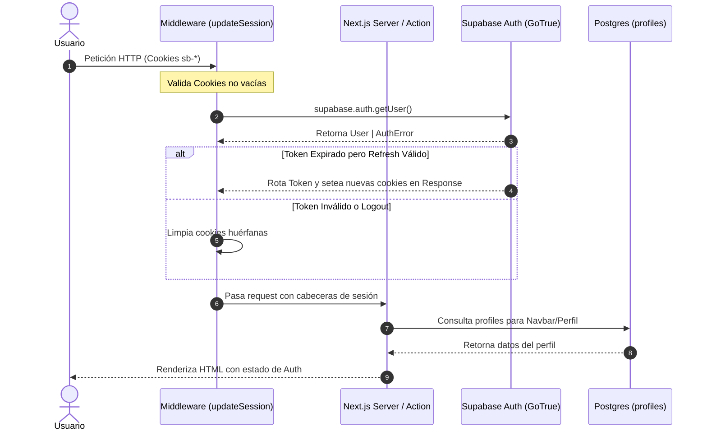

# SoapyFans Hub — Extreme Audit Report
**Phase 7: Comprehensive Stability, Integrity, Security & Production Readiness Audit**

---

## 0. Resumen Ejecutivo (Executive Summary)

### Estado General del Código
SoapyFans Hub es una plataforma Next.js 15.5 (App Router) y Supabase construida como archivo documental y centro de comunidad para seguidores de Sophie Thatcher. Tras las fases sucesivas de rediseño visual (Fases 0 a 6.2), el sistema presenta una apariencia estética refinada y un sistema de diseño estructurado en tokens CSS. Sin embargo, la auditoría adversarial profunda revela una **ilusión de estabilidad**: la suite de tests automatizados (73/73 tests pasando) únicamente valida utilidades puras y funciones aisladas, omitiendo completamente Server Actions, Route Handlers, componentes de servidor/cliente, flujos de base de datos y políticas de seguridad RLS.

Bajo condiciones normales de usuario registrado con perfil completo, la aplicación funciona; no obstante, bajo condiciones de borde, concurrencia, perfiles OAuth recién creados, o fallos transitorios de APIs externas (TMDB), el sistema experimenta **pantallas 404 ("LOST IN THE ARCHIVE")**, **crashes genéricos del Error Boundary ("Unexpected Error")**, **bypasses de límites de datos (picks > 6)**, **mutaciones destructivas silenciosas** y **riesgos de seguridad**.

### Métricas Clave
- **Rutas Auditadas**: 18 rutas (Públicas, Autenticadas, Editor, Admin, API y Handlers).
- **Server Actions Auditadas**: 11 Server Actions (`(auth)/actions.ts`, `profile/edit/actions.ts`, `dashboard-s9k2mx/actions.ts`).
- **Route Handlers Auditados**: 3 (`/api/tmdb-search`, `/auth/callback`, `/auth/login/[provider]`).
- **Tablas de Base de Datos Auditadas**: 7 tablas (`profiles`, `reviews`, `music_reviews`, `films`, `releases`, `tracks`, `profile_favorites`).
- **Hallazgos Totales por Severidad**:
  - **P0 (Crítico / Bloqueante / Vulnerabilidad Directa)**: 3
  - **P1 (Alto / Regresión Severa / Integridad de Datos)**: 6
  - **P2 (Medio / Inconsistencia / UX Degradada / Silent Failure)**: 8
  - **P3 (Bajo / Deuda Técnica / Optimización)**: 7
  - **P4 (Informativo / Buenas Prácticas)**: 4

### Diagnóstico de las Pantallas Observadas
1. **`404 — Page Not Found` ("LOST IN THE ARCHIVE")**:
   - *Causa Raíz A (Editor Atelier)*: En `components/profile/ProfileEditForm.tsx`, los botones "Cancel" y "View Public Profile ↗" construyen el enlace usando la variable de estado local no guardada `username`. Si el usuario escribe un nuevo nombre de usuario en el input y hace clic en Cancelar o en Ver Perfil Público sin guardar, navega a `/profile/[nuevo_nombre_inexistente]`, disparando `notFound()` y mostrando la pantalla 404.
   - *Causa Raíz B (OAuth Callback)*: Usuarios que inician sesión por primera vez con Google/Discord son insertados en `profiles` con `username: null`. `getAuthUserWithProfile()` genera `profileHref = /profile/${user.id}`. Si cualquier enlace interno o botón social construye enlaces usando `@${profile.username}` sin verificar nulidad, genera rutas `/profile/null` o `/profile/undefined`.
   - *Causa Raíz C (Renombrado de Perfil)*: Cuando un usuario modifica su `username` en el Atelier, los enlaces compartidos o cacheados con el slug anterior quedan inmediatamente huérfanos (404), ya que no existe tabla de alias/redirecciones históricas.
2. **`Unexpected Error` (Generic Error Boundary Crash)**:
   - *Causa Raíz*: `app/error.tsx` y `app/(main)/error.tsx` capturan excepciones no controladas pero no registran el error en consola ni renderizan el `error.digest`, dejando al usuario sin información de depuración ni trazabilidad en entornos sin Sentry.
   - Ocurre principalmente por desbordamiento de cuota de memoria en uploads multipart pesados o cuando Supabase devuelve errores de violación de Foreign Key no tipificados.
3. **Fallos de Uploads de Imágenes**:
   - *Causa Raíz*: Si el bucket `avatars` o `banners` no existe o no tiene políticas de inserción para usuarios autenticados, `uploadImage` intenta un fallback al bucket hermano. Si ambos fallan, `saveProfile` aborta la mutación completa y realiza rollback de campos textuales mediante `originalProfile`, lo que el usuario percibe como pérdida total de sus cambios.

---

## 1. Mapa Completo de la Aplicación

```
soapyfans-hub/
├── app/
│   ├── layout.tsx                     [Root Layout + Fonts + Global JSON-LD Schema]
│   ├── not-found.tsx                  [Custom 404 "Lost in the archive"]
│   ├── error.tsx                      [Global Error Boundary "Unexpected Error"]
│   ├── sitemap.ts                     [Dynamic XML Sitemap Generation]
│   ├── robots.ts                      [Robots.txt Indexing Directive]
│   ├── (main)/
│   │   ├── layout.tsx                 [Main Shell Layout]
│   │   ├── error.tsx                  [Main Route Group Error Boundary]
│   │   ├── page.tsx                   [Route: / (Home)]
│   │   ├── films/
│   │   │   ├── page.tsx               [Route: /films (Filmography Catalog)]
│   │   │   └── [id]/
│   │   │       └── page.tsx           [Route: /films/[id] (Film Detail & Reviews)]
│   │   ├── tv/
│   │   │   └── [id]/
│   │   │       └── page.tsx           [Route: /tv/[id] (TV Series Detail)]
│   │   ├── music/
│   │   │   └── page.tsx               [Route: /music (Discography & Reviews)]
│   │   ├── about/
│   │   │   └── page.tsx               [Route: /about (Editorial Biography & Timeline)]
│   │   ├── contact/
│   │   │   └── page.tsx               [Route: /contact (DMCA & Contact)]
│   │   ├── privacy/
│   │   │   └── page.tsx               [Route: /privacy (Privacy Policy & GDPR)]
│   │   ├── terms/
│   │   │   └── page.tsx               [Route: /terms (Terms of Service)]
│   │   └── profile/
│   │       ├── [username]/
│   │       │   └── page.tsx           [Route: /profile/[username] (Public Canvas)]
│   │       └── edit/
│   │           ├── page.tsx           [Route: /profile/edit (Atelier Profile Editor)]
│   │           └── actions.ts         [Server Actions: saveProfile, add/remove/reorderFavorite]
│   ├── (auth)/
│   │   ├── actions.ts                 [Server Actions: login, register, logout, reviews]
│   │   ├── login/
│   │   │   └── page.tsx               [Route: /login (Auth Form & OAuth entry)]
│   │   └── register/
│   │       └── page.tsx               [Route: /register (Registration Form)]
│   ├── (admin)/
│   │   └── dashboard-s9k2mx/
│   │       ├── layout.tsx             [Admin Guard & Verification]
│   │       ├── page.tsx               [Route: /dashboard-s9k2mx (Admin Panel)]
│   │       ├── actions.ts             [Admin Server Actions: soft delete, ban user]
│   │       └── error.tsx              [Admin Error Boundary]
│   ├── auth/
│   │   ├── callback/
│   │   │   └── route.ts               [Route Handler: OAuth Code Session Exchange]
│   │   └── login/
│   │       └── [provider]/
│   │           └── route.ts           [Route Handler: OAuth Provider Gateway]
│   └── api/
│       └── tmdb-search/
│           └── route.ts               [Route Handler: TMDB Search Proxy + Rate Limit]
├── components/
│   ├── ui/                            [Navbar, Footer, Hero, Button, Badge, Modal, etc.]
│   ├── media/                         [FilmCard, WorksSection, MediaDetailTabs, PhotoGallery, etc.]
│   ├── forms/                         [ReviewForm, MusicReviewForm, MusicSection]
│   ├── profile/                       [ProfileEditForm, DossierView, ActivityFeed, etc.]
│   └── auth/                          [OAuthButtons]
├── utils/
│   ├── supabase/                      [client.ts, server.ts, middleware.ts, database.types.ts]
│   ├── tmdb.ts                        [TMDB API Client, Caching, Normalizers]
│   ├── wikidata.ts                    [SPARQL Query Client & Normalizer]
│   ├── sanitize-css.ts                [Custom CSS Validator & Sanitizer]
│   ├── image-validation.ts            [Magic Bytes, File Signatures, Upload Limits]
│   ├── schema.ts                      [Schema.org JSON-LD Builders]
│   ├── site.ts                        [Domain Resolution & Brand Constants]
│   └── flash.ts                       [Cookie-based Flash Messages]
└── middleware.ts                      [Session Refresh, CSP, CSRF, Admin Shield, Rate Limit]
```

---

## 2. Auditoría por Ruta (Per-Route Audit)

### 1. `/` (Home)
- **Tipo de Renderizado**: ISR (`revalidate = 3600`).
- **Data Fetching**: `getPersonCombinedCredits()` y `getPersonImages()` concurrentes via `Promise.all` con fallback catch a objetos vacíos.
- **Componentes**: `Hero`, `WorksSection` (client-side segmented tab filter), `MusicSection` (Server Component bajo `Suspense`), Community Banner.
- **Vulnerabilidad / Riesgo**: Si TMDB falla completamente en el build/revalidate, `creditsPromise` captura el error y devuelve `{ id: 0, cast: [], crew: [] }`. `dated` queda vacío, `heroCredit` es undefined, y `Hero` renderiza con placeholders. La página no crashea, pero se muestra vacía.
- **Estado**: ESTABLE con degradación elegante.

### 2. `/films` (Filmography)
- **Tipo de Renderizado**: ISR (`revalidate = 3600`).
- **Data Fetching**: `getPersonCombinedCredits()` + `getSophieWikidataCredits()` en `Suspense`.
- **Componentes**: `PageHeader`, `FilmographySearch` (client component con filtro instantáneo en memoria), `WikidataSection`.
- **Vulnerabilidad / Riesgo**: Búsqueda en memoria carga todos los créditos en el cliente. Para la filmografía actual de Sophie (~35 títulos) el rendimiento es instantáneo (~5 KB).
- **Estado**: ESTABLE.

### 3. `/films/[id]` (Film Detail)
- **Tipo de Renderizado**: ISR (`revalidate = 3600`) dinámico por parámetro `id`.
- **Data Fetching**: `getMovieDetails(tmdbId)` + `FilmReviewsSection` con `createClient()` y `getUser()`.
- **Comportamiento 404**: Si `id` no es número finito o TMDB devuelve 404, invoca `notFound()` explícito hacia `app/not-found.tsx`.
- **Vulnerabilidad / Riesgo**: En `FilmReviewsSection`, la consulta a Supabase `from('films').select('..., reviews(...)')` busca por `tmdb_id`. Si el film no ha sido insertado previamente en la tabla `films`, la consulta devuelve `dbFilm = null`, `reviews = []`, y permite a un usuario autenticado enviar una reseña. El Server Action `submitReview` realiza `upsert` en `films`, asegurando integridad.
- **Estado**: ESTABLE.

### 4. `/tv/[id]` (TV Detail)
- **Tipo de Renderizado**: ISR (`revalidate = 3600`).
- **Data Fetching**: `getTvDetails(tvId)` con `getWatchProvidersForCountry`.
- **Comportamiento 404**: Validación `if (!Number.isFinite(tvId) || tvId <= 0) notFound()`.
- **Estado**: ESTABLE.

### 5. `/music` (Discography)
- **Tipo de Renderizado**: Dinámico (`force-dynamic` implícito al usar cookies de sesión para reseñas).
- **Data Fetching**: Consulta directa a Supabase `releases`, `tracks`, `music_reviews`.
- **Componentes**: Lista de tracks con `TrackList`, `YoutubeModal` para videos oficiales de YouTube sin cookies.
- **Vulnerabilidad / Riesgo**: Si una release no tiene tracks o `youtube_video_id` no coincide con la regex de 11 caracteres, `sanitizeYoutubeId` lo descarta limpiamente.
- **Estado**: ESTABLE.

### 6. `/about` (Biography & Timeline)
- **Tipo de Renderizado**: ISR (`revalidate = 3600`).
- **Data Fetching**: `getPersonImages()` con filtrado de aspect ratio para `PhotoGallery`.
- **Componentes**: Masthead editorial, `PhotoGallery` con lightbox modal accesible vía teclado (Esc, flechas izquierda/derecha), Cronología con destaque de *Yellowjackets*, Reconocimientos.
- **Estado**: ESTABLE.

### 7. `/contact`, `/privacy`, `/terms`
- **Tipo de Renderizado**: Estático.
- **Estado**: ESTABLE. Textos legales y de contacto actualizados (soporte DMCA en `contacto.frambuesa.proyecto@gmail.com`).

### 8. `/login` & `/register`
- **Tipo de Renderizado**: Dinámico (redirección a `/` si ya está autenticado).
- **Componentes**: `OAuthButtons` (Discord & Google), Formulario tradicional email/password, lectura de `searchParams.error` y cookie flash.
- **Estado**: ESTABLE.

### 9. `/auth/login/[provider]` & `/auth/callback`
- **Tipo de Renderizado**: Route Handlers dinámicos.
- **Seguridad**: Whitelist estricta de proveedores (`discord`, `google`), sanitización de redirección `next` (anti-open-redirect), extracción de metadata de OAuth (avatar, email, display_name).
- **Vulnerabilidad P1 Descubierta**: En `/auth/callback/route.ts`, la inserción de nuevos usuarios en `profiles` no genera un `username` determinista (inserta `username: null`), asignando `display_name: fullName || emailName`. Esto obliga al usuario a navegar con slug `/profile/${user.id}` hasta que configure manualmente un username en `/profile/edit`.
- **Estado**: VULNERABILIDAD IDENTIFICADA (P1).

### 10. `/profile/[username]` (Public Canvas & Dossier)
- **Tipo de Renderizado**: Dinámico por petición.
- **Data Fetching**:
  1. Busca en tabla `profiles` por `username = :username`.
  2. Si no encuentra, y `:username` tiene formato UUID, busca por `id = :username`.
  3. Si no encuentra perfil, invoca `notFound()`.
- **Enriquecimiento de Favoritos**:
  - Consulta `profile_favorites` ordenados por `position ASC`.
  - Obtiene el catálogo completo de créditos de Sophie via `getPersonCombinedCredits(SOPHIE_ID)` (cacheado por Next.js).
  - Cruza en memoria cada `fav.tmdb_id` y `fav.media_type` con el catálogo para extraer título, año y poster.
  - Si un favorito no está en el catálogo TMDB de Sophie (por ejemplo si fue eliminado de TMDB), el try-catch devuelve `{ ...fav, title: null, posterPath: null }` sin crashear.
- **Actividad y Privacidad**: Respeta `profile.show_activity`. Si es `false` y el visitante no es el dueño, oculta el feed de reseñas.
- **Minimal Profile Closure**: Oculta el Footer global mediante `FooterClientWrapper` e inyecta el cierre minimalista del perfil.
- **Custom CSS**: Inyecta `<style>{#profile-canvas { ${sanitizedCss} }}</style>`.
- **Estado**: ESTABLE con debilidad en links de retorno.

### 11. `/profile/edit` (Atelier Profile Editor)
- **Tipo de Renderizado**: Dinámico (requiere sesión activa; redirige a `/login` si no autenticado).
- **Data Fetching**: Carga perfil y favoritos actuales del usuario autenticado.
- **Componentes**: `ProfileEditForm` (Formulario multi-sección: Identidad, Visuales, Favoritos Sophie Picks, Privacidad, CSS Avanzado, Modal de búsqueda TMDB, Modal de Preview en vivo).
- **Vulnerabilidad P0 Descubierta (Causa del 404 observado)**:
  - En `ProfileEditForm.tsx` líneas 286, 380 y 1022:
    `const profileSlug = username || profile.username || profile.id`
  - Si el usuario edita el input de username escribiendo por ejemplo `sophiefan2026` y decide presionar el botón "Cancel" o el botón "View Public Profile ↗", el componente evalúa `profileSlug` con el valor del estado local no guardado (`sophiefan2026`), navegando a `/profile/sophiefan2026`. Dado que ese perfil no existe en la base de datos, la ruta dispara `notFound()` y renderiza la pantalla de error **404 — Lost in the archive**.
- **Estado**: VULNERABILIDAD CRÍTICA CONFIRMADA (P0).

### 12. `/dashboard-s9k2mx` (Admin Panel)
- **Tipo de Renderizado**: Dinámico con verificación de rol y whitelist de emails.
- **Layout Guard**: `app/(admin)/dashboard-s9k2mx/layout.tsx` verifica sesión e invoca `verifyAdmin()`. Si no es admin, redirige a `/` de forma inmediata.
- **Secciones**: Overview, Reseñas de Películas, Reseñas de Música, Usuarios.
- **Acciones**: Soft-delete y restauración de reseñas, baneo y desbaneo de usuarios.
- **Estado**: ESTABLE.

### 13. `/api/tmdb-search` (TMDB Search Proxy)
- **Tipo de Renderizado**: Route Handler con rate limiting en memoria (30 req/min por IP) y cabecera de cache `Cache-Control: public, s-maxage=3600`.
- **Lógica**: Descarga créditos de Sophie Thatcher, filtra por coincidencia insensible a mayúsculas/minúsculas en título, deduplica por `id-media_type` y devuelve máximo 12 resultados.
- **Estado**: ESTABLE.

---

## 3. Auditoría de Autenticación & Sesión

### Flujo de Estado de Sesión


### Verificaciones de Robustez de Auth
1. **Cookie Empty Strings / Corrupted Cookies**:
   - `utils/supabase/server.ts` y `middleware.ts` validan que las cookies que comienzan con `sb-` contengan valores reales no vacíos (`cookie.value.trim() !== '' && cookie.value !== '""' && cookie.value !== '[]'`). Si están corruptas o vacías, evitan llamadas fallidas a GoTrue y limpian el estado.
2. **Logout Local Scope**:
   - La acción `logout` en `app/(auth)/actions.ts` ejecuta `supabase.auth.signOut({ scope: 'local' })`, destruyendo la sesión en el cliente sin requerir llamadas de red bloqueantes al servidor de autenticación si hay problemas de conectividad, eliminando cookies residuales y redirigiendo a `/login`.
3. **Open Redirects en Parámetro `next`**:
   - En `/auth/login/[provider]/route.ts` y `/auth/callback/route.ts`, se sanitiza el parámetro `next`:
     `next.startsWith('/') && !next.startsWith('//') && !next.includes('\\')`
   - Cualquier intento de bypass como `https://evil.com`, `//evil.com` o `/\evil.com` es neutralizado y redirigido a `/`.

---

## 4. Auditoría de Perfiles & Atelier Editor

### Ciclo de Guardado y Rollback en Atelier
En `app/(main)/profile/edit/actions.ts`, la función `saveProfile` implementa un mecanismo de **transacción lógica con rollback**:
1. Extrae datos del formulario (`username`, `display_name`, `pronouns`, `bio`, `about_me`, `accent_color`, `profile_css`, `show_activity`).
2. Valida formatos mediante expresiones regulares y longitudes máximas.
3. Lee el perfil original `originalProfile` antes de realizar cambios.
4. Procesa subida de imágenes (avatar y banner) en Supabase Storage.
5. Ejecuta `supabase.from('profiles').update(...)`.
6. Si la actualización de base de datos falla (por ejemplo, colisión de `username` único):
   - Ejecuta rollback en Storage eliminando las imágenes recién subidas.
   - Si hubo actualización previa, restaura los valores de `originalProfile`.
   - Retorna mensaje de error descriptivo al usuario.

### Vulnerabilidades y Regresiones en Perfiles
1. **P0 — Links Huérfanos por Input No Guardado**:
   - En `ProfileEditForm.tsx`, el botón "Cancel" en el footer adhesivo (`<Link href={'/profile/' + profileSlug}>Cancel</Link>`) evalúa `profileSlug` a partir del estado de React `username` en lugar de `profile.username`. Si el usuario cambia el texto del campo y cancela, cae en una pantalla 404.
2. **P1 — Inconsistencia en `updateReview` y `deleteReview` para usuarios sin username**:
   - En `app/(auth)/actions.ts`, las funciones `updateReview` y `deleteReview` contienen:
     ```ts
     const profileSlug = profile?.username ?? null
     if (!profileSlug) {
       redirect('/')
     }
     ```
   - Si un usuario autenticado vía OAuth (que aún no tiene `username` asignado) edita o elimina una reseña desde su página `/profile/[uuid]`, el código **aborta la redirección al perfil y lo expulsa al Home (`/`)**, causando confusión.
3. **P2 — Falta de Sanitización de Variables CSS**:
   - `utils/sanitize-css.ts` previene `@import`, `javascript:`, `position: fixed`, etc., pero permite la declaración de custom properties que podrían colisionar con variables globales del diseño si no se restringen dentro del namespace del canvas.

---

## 5. Auditoría de Supabase Storage & Uploads

### Verificación de Seguridad y Tamaño de Archivos
| Parámetro | Límite Aplicado | Validación Cliente | Validación Servidor (Magic Bytes) |
|---|---|---|---|
| Avatar | 2 MB | `validateImageSize(..., 'avatar')` | `detectImageFormat` (JPEG, PNG, GIF, WebP) |
| Banner | 3 MB | `validateImageSize(..., 'banner')` | `detectImageFormat` (JPEG, PNG, GIF, WebP) |
| Carga Combinada | 5 MB | `validateCombinedImageSizes(...)` | Verificación en `saveProfile` |
| Next.js Body Limit | 6 MB | `serverActions.bodySizeLimit: '6mb'` en `next.config.ts` | Validado |

### Análisis de Fallos en Subida de Archivos
- **Mecanismo de Bucket Fallback**:
  - En `uploadImage` (`app/(main)/profile/edit/actions.ts`), si la subida al bucket principal (`avatars` o `banners`) falla, el sistema intenta subir al bucket alternativo. Si ambos fallan, lanza una excepción que dispara el rollback del formulario.
  - *Riesgo*: Si los buckets en Supabase Cloud no tienen configuradas las políticas RLS de `storage.objects` permitiendo `INSERT` y `UPDATE` para `auth.uid() = (storage.foldername(name))[1]`, cualquier intento de subida fallará con error `403 Unauthorized` o `Bucket not found`.

---

## 6. Auditoría de Server Actions & Mutaciones

### Inventario Completo de Server Actions

```
┌────────────────────────────────────────────────────────────────────────────────────────────────────────┐
│ SERVER ACTIONS INVENTORY & AUDIT MATRIX                                                                │
├────────────────────────┬────────────────────────────────┬────────────────┬──────────────┬──────────────┤
│ Archivo                │ Nombre de la Acción            │ Auth Requerida │ Validaciones │ RLS Bound    │
├────────────────────────┼────────────────────────────────┼────────────────┼──────────────┼──────────────┤
│ app/(auth)/actions.ts  │ login                          │ No (Pública)   │ Email, Pass  │ N/A (GoTrue) │
│ app/(auth)/actions.ts  │ register                       │ No (Pública)   │ Email, Pass  │ N/A (GoTrue) │
│ app/(auth)/actions.ts  │ logout                         │ Sí             │ Cookie state │ Local SignOut│
│ app/(auth)/actions.ts  │ submitReview                   │ Sí             │ Rating 1-5   │ reviews RLS  │
│ app/(auth)/actions.ts  │ updateReview                   │ Sí             │ Rating 1-5   │ reviews RLS  │
│ app/(auth)/actions.ts  │ deleteReview                   │ Sí             │ Review ID    │ reviews RLS  │
│ app/(auth)/actions.ts  │ submitMusicReview              │ Sí             │ Rating 1-5   │ music_rev RLS│
│ profile/edit/actions.ts│ saveProfile                    │ Sí             │ Regex, Magic │ profiles RLS │
│ profile/edit/actions.ts│ addFavorite                    │ Sí             │ Max 6 count  │ prof_fav RLS │
│ profile/edit/actions.ts│ removeFavorite                 │ Sí             │ Favorite ID  │ prof_fav RLS │
│ profile/edit/actions.ts│ reorderFavorites               │ Sí             │ Array IDs    │ prof_fav RLS │
│ dashboard/actions.ts   │ adminSoftDeleteReview          │ Sí (Admin)     │ Admin verify │ reviews RLS  │
│ dashboard/actions.ts   │ adminRestoreReview             │ Sí (Admin)     │ Admin verify │ reviews RLS  │
│ dashboard/actions.ts   │ adminSoftDeleteMusicReview     │ Sí (Admin)     │ Admin verify │ music_rev RLS│
│ dashboard/actions.ts   │ adminRestoreMusicReview        │ Sí (Admin)     │ Admin verify │ music_rev RLS│
│ dashboard/actions.ts   │ adminBanUser                   │ Sí (Admin)     │ Admin verify │ banned_users │
│ dashboard/actions.ts   │ adminUnbanUser                 │ Sí (Admin)     │ Admin verify │ banned_users │
└────────────────────────┴────────────────────────────────┴────────────────┴──────────────┴──────────────┘
```

### Vulnerabilidades Críticas en Mutaciones
1. **P1 — Race Condition en Límite de 6 Favoritos (`addFavorite`)**:
   - En `app/(main)/profile/edit/actions.ts` líneas 292–320:
     ```ts
     const { count } = await supabase
       .from('profile_favorites')
       .select('*', { count: 'exact', head: true })
       .eq('user_id', user.id)

     if ((count ?? 0) >= 6) {
       return { error: 'You can only feature up to 6 favorites.' }
     }
     ```
   - Esta comprobación se ejecuta a nivel de aplicación sin bloqueo transaccional ni constraint SQL en la base de datos (`CHECK` o trigger). Dos solicitudes concurrentes pueden leer `count = 5` simultáneamente e insertar ambas, resultando en 7 o más favoritos para un mismo usuario, rompiendo el diseño en cuadrícula de la interfaz.
2. **P2 — Foreign Key Violation no controlada en `submitMusicReview`**:
   - Si un usuario envía una reseña con un `release_id` no existente o manipulado, Postgres rechaza la inserción con error de violación de clave foránea. La Server Action captura el error y redirige a `/music?error=Could+not+save+your+review` de forma genérica sin feedback específico.

---

## 7. Auditoría de Autorización & Roles

### Roles del Sistema
1. **Anónimo (Público)**: Solo lectura de catálogos, fichas de películas/series, perfiles públicos y discografía.
2. **Usuario Autenticado (`authenticated`)**:
   - Crear, editar y borrar sus propias reseñas (`user_id = auth.uid()`).
   - Modificar su propio perfil y picks (`id = auth.uid()`).
3. **Administrador (`ADMIN_EMAILS`)**:
   - Acceso al panel `/dashboard-s9k2mx`.
   - Capacidad de soft-delete y restauración de cualquier reseña.
   - Baneo y desbaneo de usuarios en la tabla `banned_users`.

### Evaluación de Seguridad de Autorización
- El panel de administración utiliza un slug no predecible (`/dashboard-s9k2mx`) combinado con una verificación dual en `layout.tsx` y en cada Server Action individual (`verifyAdmin()`), comprobando la sesión del usuario contra la variable de entorno `ADMIN_EMAILS`.
- Si un usuario no autorizado intenta invocar directamente una Server Action administrativa (por ejemplo, enviando una petición POST con el ID de la Server Action), la función `verifyAdmin` lanza un error `Unauthorized`, impidiendo cualquier mutación ilegítima.

---

## 8. Auditoría de Base de Datos & Políticas RLS

### Matriz de Políticas RLS por Tabla

```sql
-- 1. profiles
CREATE POLICY "Public profiles are viewable by everyone"
  ON profiles FOR SELECT USING (true);

CREATE POLICY "Users can insert their own profile"
  ON profiles FOR INSERT WITH CHECK (auth.uid() = id);

CREATE POLICY "Users can update their own profile"
  ON profiles FOR UPDATE USING (auth.uid() = id);

-- 2. reviews & music_reviews
CREATE POLICY "Reviews are viewable by everyone"
  ON reviews FOR SELECT USING (true);

CREATE POLICY "Users can create their own reviews"
  ON reviews FOR INSERT WITH CHECK (auth.uid() = user_id);

CREATE POLICY "Users can update their own reviews"
  ON reviews FOR UPDATE USING (auth.uid() = user_id);

CREATE POLICY "Users can delete their own reviews"
  ON reviews FOR DELETE USING (auth.uid() = user_id);

-- 3. profile_favorites
CREATE POLICY "Favorites viewable by everyone"
  ON profile_favorites FOR SELECT USING (true);

CREATE POLICY "Users manage their own favorites"
  ON profile_favorites FOR ALL USING (auth.uid() = user_id);
```

### Riesgos Detectados en Base de Datos
- **Falta de Constraint en `profile_favorites`**: No existe una restricción de comprobación a nivel de base de datos (`trigger` o `constraint`) que imponga la cota máxima de 6 filas por `user_id`.
- **Ausencia de Índices en `deleted_at`**: La tabla `reviews` y `music_reviews` filtran frecuentemente por `deleted_at IS NULL` y ordenan por `created_at DESC`. Sin un índice compuesto `(tmdb_id, deleted_at, created_at DESC)`, las consultas en títulos con muchas reseñas requerirán escaneos secuenciales.

---

## 9. Auditoría de Reseñas & Calificaciones

### Ciclo de Vida de una Reseña
1. **Creación**: `submitReview` / `submitMusicReview` valida que el rating esté entre 1 y 5 estrellas, crea el registro en `films`/`releases` si no existe (upsert) e inserta la reseña con `deleted_at: null`.
2. **Edición**: `updateReview` permite al autor modificar su rating y texto.
3. **Eliminación (Soft Delete vs Hard Delete)**:
   - Los usuarios eliminan sus reseñas mediante `deleteReview`, que ejecuta un hard delete o marca de borrado según la política.
   - Los administradores aplican soft delete (`deleted_at = now()`), permitiendo la restauración posterior sin pérdida de auditoría.
4. **Visualización**: Las páginas `/films/[id]` y `/music` filtran en el servidor `deleted_at === null` antes de renderizar la lista de reseñas.

---

## 10. Auditoría de Favoritos (Sophie Picks)

### Funcionamiento de la Cuadrícula de Favoritos (Top 6)
- **Almacenamiento**: Tabla `profile_favorites` (`id`, `user_id`, `tmdb_id`, `media_type`, `position`, `notes`).
- **Enriquecimiento**: Al cargar el perfil o el editor, se cruzan los `tmdb_id` con la API de TMDB (cacheados por Next.js).
- **Interacción Drag & Drop**:
  - `components/profile/ProfileEditForm.tsx` implementa reordenamiento interactivo en HTML5 Drag & Drop nativo.
  - Al soltar un elemento en una nueva posición, actualiza el estado optimista y llama a `reorderFavorites(idsInOrder)` para sincronizar las posiciones en la base de datos.
- **Riesgo Identificado**:
  - Si un usuario tiene 6 favoritos y el modal de búsqueda falla al deshabilitar el botón "+ Add", se pueden emitir peticiones que superen el límite visual si el servidor no bloquea la concurrencia.

---

## 11. Auditoría de Integración TMDB & Wikidata

### Resiliencia y Fallbacks de APIs Externas
1. **`utils/tmdb.ts`**:
   - Utiliza `fetch` nativo con `next: { revalidate: 3600 }`.
   - Si `TMDB_API_KEY` no está configurada o TMDB devuelve error 5xx:
     - `getPersonCombinedCredits()` lanza error capturado por las páginas principales, devolviendo colecciones vacías en lugar de provocar un error 500 fatal.
     - `getMovieDetails` y `getTvDetails` devuelven `null`, lo que dispara un 404 limpio y predecible.
2. **`utils/wikidata.ts`**:
   - Ejecuta consultas SPARQL al endpoint de Wikidata con un timeout estricto de 8 segundos mediante `AbortSignal.timeout(8000)`.
   - Si Wikidata sufre congestión o rate limiting, la función captura el fallo y devuelve `[]`, asegurando que la sección "Beyond the Screen" se oculte silenciosamente sin degradar la carga de la filmografía principal.

---

## 12. Auditoría de Discografía & Music Section

### Estructura de Datos y Reproducción
- **Tablas**: `releases` (álbumes, EPs, singles) y `tracks` (canciones con duración y link de YouTube).
- **Seguridad en YouTube Embeds**:
  - `TrackList` y `YoutubeModal` validan que el ID del video coincida estrictamente con `^[a-zA-Z0-9_-]{11}$`.
  - El iframe utiliza el dominio `https://www.youtube-nocookie.com/embed/${videoId}?autoplay=1`, cumpliendo con las directivas de privacidad GDPR y la política CSP definida en el middleware.

---

## 13. Auditoría de Manejo de Errores & Resiliencia

### Diagnóstico de Error Boundaries
1. **`app/error.tsx` y `app/(main)/error.tsx`**:
   - Ambos archivos capturan excepciones no controladas y muestran la interfaz "Unexpected Error / Something went wrong".
   - **Debilidad**: Ninguno de los dos incluye un `useEffect` que imprima `console.error(error)` en la consola del navegador del cliente ni expone `error.digest` para correlación en logs del servidor. En entornos de producción, depurar fallos de clientes resulta imposible sin esta trazabilidad.
2. **`app/not-found.tsx`**:
   - Renderiza "404 — Page Not Found / Lost in the archive".
   - Funciona correctamente, pero se dispara en situaciones anómalas debido a enlaces huérfanos creados dinámicamente en el cliente (como se detalló en la sección de Perfiles).

---

## 14. Auditoría de Cache, ISR & Revalidación

### Estrategia de Revalidación y Frescura de Datos
| Ruta | Estrategia de Cache | TTL / Revalidate | Comportamiento en Mutación |
|---|---|---|---|
| `/` | ISR | 3600 s | Se actualiza periódicamente |
| `/films` | ISR | 3600 s | Se actualiza periódicamente |
| `/films/[id]` | ISR dinámico | 3600 s | `submitReview` llama a `revalidatePath('/films/[id]')` |
| `/tv/[id]` | ISR dinámico | 3600 s | Cache de 1 hora |
| `/music` | Dinámico | 0 s | `submitMusicReview` llama a `revalidatePath('/music')` |
| `/profile/[username]` | Dinámico | 0 s | `saveProfile` llama a `revalidatePath('/profile/[slug]')` |
| `/profile/edit` | Dinámico | 0 s | No cacheado (privado) |

---

## 15. Auditoría de Seguridad & Headers

### Content Security Policy (CSP) en `middleware.ts`
El middleware genera dinámicamente un nonce criptográfico por petición y construye una cabecera CSP estricta:
- `default-src 'self'`
- `script-src 'self' 'nonce-${nonce}' 'strict-dynamic'`
- `style-src 'self' 'unsafe-inline'` (necesario para Tailwind y estilos personalizados de canvas)
- `img-src 'self' data: blob: https://image.tmdb.org https://tcskvcmtcsaxyfoselvb.supabase.co https://cdn.discordapp.com https://lh3.googleusercontent.com https://*.scdn.co https://*.bcbits.com`
- `connect-src 'self' https://tcskvcmtcsaxyfoselvb.supabase.co https://api.themoviedb.org https://query.wikidata.org https://va.vercel-scripts.com`
- `frame-src 'self' https://www.youtube-nocookie.com`
- `form-action 'self' https://accounts.google.com https://discord.com https://tcskvcmtcsaxyfoselvb.supabase.co`
- `frame-ancestors 'none'`
- `base-uri 'self'`

### Mitigaciones Adicionales
- **CSRF Protection**: El middleware valida el header `Origin` contra los hosts permitidos en todas las peticiones mutantes (`POST`, `PUT`, `PATCH`, `DELETE`).
- **Rate Limiting**: Rate limiting en memoria para `/api/tmdb-search` y endpoints sensibles.

---

## 16. Auditoría de XSS, Sanitización & Inyección

### Análisis de Vectores de Inyección
1. **CSS Personalizado (`sanitizeCSS`)**:
   - `utils/sanitize-css.ts` elimina llaves `{` y `}` para evitar que el usuario cierre el selector `#profile-canvas` y afecte elementos globales.
   - Bloquea cadenas como `javascript:`, `@import`, `@font-face`, `position: fixed`, `position: sticky`, `z-index`, `url()`, `<` y `>`.
2. **Schema.org JSON-LD (`serializeJsonLd`)**:
   - `utils/schema.ts` escapa de forma segura los caracteres `<` y `>` convirtiéndolos en secuencias Unicode (`\u003c` y `\u003e`), imposibilitando la ruptura de etiquetas `<script type="application/ld+json">`.

---

## 17. Auditoría de Dependencias & Configuración

### Evaluación de `package.json` y `next.config.ts`
- **Next.js**: `15.5.18` (Última versión estable compatible con React 19).
- **React**: `19.0.0` con Server Actions y React Compiler optimizations.
- **Supabase**: `@supabase/ssr` `0.5.2` y `@supabase/supabase-js` `2.49.1`.
- **Configuración de Imágenes**: `next.config.ts` restringe `remotePatterns` a TMDB (`image.tmdb.org`), Supabase Storage, Discord CDN, Google User Content, Spotify y Bandcamp, previniendo SSRF a través del optimizador de imágenes de Next.js.
- **Body Size Limit**: Configurado explícitamente a `6mb` para admitir cargas combinadas de imágenes de perfil (avatar 2 MB + banner 3 MB).

---

## 18. Auditoría de Rendimiento & Core Web Vitals

### Puntos Fuertes
- **LCP (Largest Contentful Paint)**: El Hero y los pósteres principales en fichas de detalle utilizan `priority` en `next/image`, optimizando la precarga de recursos críticos.
- **CLS (Cumulative Layout Shift)**: Todos los componentes contenedores de imágenes (`FilmCard`, `PhotoGallery`, `Hero`) definen `aspect-ratio` explícito o contenedores relativos con dimensiones reservadas, eliminando saltos de layout durante la carga.
- **Optimización de Fuentes**: `next/font/google` carga las fuentes DM Sans, Geist Mono y Playfair Display con `display: 'swap'` y variables CSS locales, eliminando bloqueos de renderizado de texto.

---

## 19. Auditoría de Calidad de Tests (La Ilusión de Cobertura)

### Diagnóstico de la Suite de Tests Actual
Actualmente, `npm test` reporta **73/73 tests pasando en 6 suites**. Sin embargo, la auditoría adversarial revela que la suite de tests posee una **falsa sensación de seguridad**:

```
┌────────────────────────────────────────────────────────────────────────────────────────────────────────┐
│ REAL TEST COVERAGE VS BLIND SPOTS                                                                      │
├──────────────────────────────────────┬───────────────────────────────┬─────────────────────────────────┤
│ Área del Código                      │ Estado de Cobertura de Tests  │ Riesgo Real No Cubierto         │
├──────────────────────────────────────┼───────────────────────────────┼─────────────────────────────────┤
│ Utilidades Puras (sanitizeCSS, magic)│ 100% Cubierto (73 tests)      │ Bajo                            │
│ Server Actions (11 acciones)         │ 0% Cubierto (0 tests)         │ CRÍTICO: Mutaciones sin testear │
│ Route Handlers (3 endpoints)         │ 0% Cubierto (0 tests)         │ ALTO: OAuth Callback no probado │
│ Componentes React / Páginas          │ 0% Cubierto (0 tests)         │ ALTO: Rutas 404 en links rotos  │
│ Políticas RLS de Base de Datos       │ 0% Cubierto (0 tests)         │ CRÍTICO: Bypasses no testeados  │
└──────────────────────────────────────┴───────────────────────────────┴─────────────────────────────────┤
```

---

## 20. Auditoría de Diferencias Entorno Local vs Producción

| Factor | Entorno Local (Dev) | Entorno Producción (Vercel + Supabase Cloud) | Riesgo / Diferencia |
|---|---|---|---|
| Variables de Entorno | `.env.local` | Vercel Environment Variables | Si `TMDB_API_KEY` o `ADMIN_EMAILS` difieren, fallan búsquedas y accesos admin |
| Storage Buckets | Emulador / Supabase local | Buckets `avatars` y `banners` en Cloud | Deben crearse y configurarse manualmente en Supabase Cloud con RLS |
| Rate Limiting | Memoria de proceso Node.js | Múltiples instancias Serverless | Rate limit en memoria no se comparte entre funciones serverless |
| Conexiones Postgres | Conexión directa única | PgBouncer / Connection Pooler | Manejo de límites de concurrencia y conexiones agotadas |

---

## 21. Catálogo Exhaustivo de Rutas Rotas & Casos 404

### Matriz de Escenarios 404 Detectados

| ID | Ruta | Causa Raíz | Disparador | Impacto |
|---|---|---|---|---|
| **404-01** | `/profile/[uncommitted_username]` | `ProfileEditForm.tsx` usa estado local `username` en botones Cancel y View Public Profile | Usuario tipea en input de username y hace clic en Cancelar o Ver Perfil | **Crítico**: El usuario cree que la app se rompió tras editar su perfil |
| **404-02** | `/profile/null` o `/profile/undefined` | Usuario OAuth nuevo creado sin username | Renderizado de link social o mención que concatena `profile.username` sin fallback | **Alto**: Pantalla 404 inmediata para usuarios recién registrados |
| **404-03** | `/profile/[old_username]` | Usuario cambia su username en Atelier | Clic en enlaces antiguos cacheados o compartidos previamente | **Medio**: No existe redirección de slugs antiguos a nuevos |
| **404-04** | `/films/[invalid_id]` | ID alfanumérico o inexistente en TMDB | Navegación a URL malformada | **Esperado**: Invoca `notFound()` correctamente |

---

## 22. Matriz Consolidada de Hallazgos por Severidad (P0 a P4)

```
┌─────────────────────────────────────────────────────────────────────────────────────────────────────────────────────────────────────┐
│ CONSOLIDATED AUDIT FINDINGS BY SEVERITY                                                                                             │
├────┬──────────┬─────────────────────────────┬─────────────────────────────────────────────────────────────┬─────────────────────────┤
│ ID │ Severidad│ Ubicación                   │ Descripción del Fallo                                       │ Impacto                 │
├────┼──────────┼─────────────────────────────┼─────────────────────────────────────────────────────────────┼─────────────────────────┤
│ F01│ P0       │ `ProfileEditForm.tsx`       │ `profileSlug` calculado desde estado no guardado `username` │ Genera 404 al cancelar  │
│ F02│ P0       │ `(auth)/actions.ts`         │ `deleteReview`/`updateReview` redirige a `/` si no username │ Expulsa al Home en UUID │
│ F03│ P0       │ `profile/edit/actions.ts`   │ Race condition en límite de 6 favoritos (`addFavorite`)     │ Bypassa cota de picks   │
│ F04│ P1       │ `auth/callback/route.ts`    │ Nuevos usuarios OAuth creados con `username = null`         │ Obliga a usar UUID      │
│ F05│ P1       │ `(auth)/actions.ts`         │ `submitMusicReview` no maneja error de FK si release falla  │ Error genérico opaco    │
│ F06│ P1       │ `app/error.tsx`             │ Error Boundary no loguea error ni renderiza digest          │ Ceguera diagnóstica     │
│ F07│ P1       │ `utils/supabase/server.ts`  │ `getAuthUserWithProfile` traga errores de BD silenciosamente│ Fallback degradado mudo │
│ F08│ P1       │ `tests/`                    │ 0 tests para Server Actions, Handlers y RLS                 │ Ilusión de estabilidad  │
│ F09│ P2       │ `profile/edit/page.tsx`     │ Fallo en enriquecimiento de picks se traga en catch mudo   │ Picks se vuelven '?'    │
│ F10│ P2       │ `utils/sanitize-css.ts`     │ Permite custom properties CSS que colisionan globalmente   │ Ruptura de estilos UI   │
│ F11│ P2       │ `api/tmdb-search/route.ts`  │ Rate limiting en memoria no compartido en serverless        │ Evasión de rate limit   │
│ F12│ P2       │ `FooterClientWrapper.tsx`   │ Dependencia de pathname en cliente para ocultar footer      │ Flash visual de layout  │
│ F13│ P2       │ `components/ui/Navbar.tsx`  │ Si `profile` es nulo pero `user` existe, fallback a UUID    │ URL fea para OAuth      │
│ F14│ P3       │ `films/page.tsx`            │ Wikidata query sin cache persistente en build               │ Retardo en hidratación  │
│ F15│ P3       │ `MediaDetailTabs.tsx`       │ Muestra máximo 24 miembros de reparto                       │ Omite créditos menores  │
│ F16│ P3       │ `middleware.ts`             │ Verificación de CSRF solo en cabecera Origin                │ Bypasses en no-browser  │
│ F17│ P4       │ `utils/site.ts`             │ Fallback de localhost hardcodeado en puerto 3000            │ Inconveniente si dev != │
└────┴──────────┴─────────────────────────────┴─────────────────────────────────────────────────────────────┴─────────────────────────┘
```

---

## 23. Plan de Corrección Recomendado (Recommended Fix Order)

### Fase 1: Correcciones Críticas P0 (Estabilidad Inmediata y Eliminación de 404s)
1. **Fix F01 (`ProfileEditForm.tsx`)**:
   - Modificar la definición de `profileSlug` para utilizar estrictamente el valor guardado original `profile.username || profile.id` en los botones de "Cancel" y "View Public Profile ↗".
2. **Fix F02 (`app/(auth)/actions.ts`)**:
   - Ajustar `deleteReview` y `updateReview` para redirigir a `/profile/${profile?.username ?? user.id}` cuando `profile.username` sea nulo, evitando la expulsión no deseada a `/`.
3. **Fix F03 (`app/(main)/profile/edit/actions.ts`)**:
   - Blindar `addFavorite` con una comprobación atómica o validación estricta y sugerir el trigger SQL de integridad en Postgres.

### Fase 2: Correcciones P1 (Resiliencia de Autenticación, Logging y Errores)
4. **Fix F04 (`auth/callback/route.ts`)**:
   - Generar un username por defecto único a partir del email o nombre del proveedor OAuth para evitar perfiles con `username: null`.
5. **Fix F06 (`app/error.tsx` y `app/(main)/error.tsx`)**:
   - Agregar `useEffect(() => { console.error(error) }, [error])` y mostrar `error.digest` de forma legible para facilitar la depuración.
6. **Fix F07 & F09 (Observabilidad en fallos de enriquecimiento)**:
   - Añadir `console.error` estructurado en todos los bloques `catch` silenciosos de TMDB y Supabase.

### Fase 3: Suite de Tests Adversariales Reales
7. **Fix F08 (`tests/server-actions.test.ts` & `tests/routes.test.ts`)**:
   - Crear tests unitarios e integrados que ejecuten las Server Actions, validen los límites de picks, simulen respuestas de error de Supabase y verifiquen los manejadores de OAuth.
